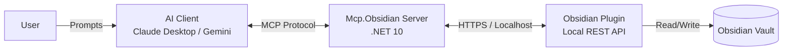

## Mcp.Obsidian


**Mcp.Obsidian** is a Model Context Protocol (MCP) server that bridges AI agents (Claude, Gemini, etc.) with your local Obsidian vault. 

It allows LLMs to read, search, and edit your notes safely using the [Obsidian Local REST API](https://github.com/coddingtonbear/obsidian-local-rest-api), keeping your knowledge base local-first while enabling AI automation.

> [!TIP]
> **See it in action:**
>
> *(Place an animated GIF here showing Claude creating a note in Obsidian)*
> ``

---

🏗 Architecture



---

## 🚀 Getting Started

1. Prerequisites

* **Obsidian Desktop** installed.
* **.NET 10 SDK** installed.
* **Obsidian Local REST API Plugin**:
1. Open Obsidian → Settings → Community Plugins.
2. Install and Enable **Local REST API** (by coddingtonbear).
3. In the plugin settings, copy your **API Key**.


## 2. Installation

Clone the repository:

```bash
git clone [https://github.com/yourusername/Mcp.Obsidian.git](https://github.com/yourusername/Mcp.Obsidian.git)
cd Mcp.Obsidian

```

## 3. Configuration

Create an `appsettings.json` file in the project root:

```json
{
  "Logging": {
    "LogLevel": {
      "Default": "Information",
      "Microsoft.AspNetCore": "Warning"
    }
  },
  "Obsidian": {
    "BaseUrl": "https://localhost:27123",
    "ApiKey": "YOUR_OBSIDIAN_API_KEY_HERE",
    "VerifySsl": false
  }
}

```

4. Integration (Claude Desktop)

To use this with Claude Desktop, add the following to your `claude_desktop_config.json`:

```json
{
  "mcpServers": {
    "obsidian": {
      "command": "dotnet",
      "args": [
        "run",
        "--project",
        "/absolute/path/to/Mcp.Obsidian/src/Mcp.Obsidian/Mcp.Obsidian.csproj"
      ]
    }
  }
}

```

---

## 🛠 Available Tools

The server exposes the following tools to the AI agent:

| Tool | Description |
| --- | --- |
| `obsidian_search` | Uses the REST API to fuzzy search file names and content. |
| `obsidian_read_note` | Retrieves the full markdown content of a specific note. |
| `obsidian_create_note` | Creates a new note with specified path and content. |
| `obsidian_append` | Appends text to the end of an existing note. |
| `obsidian_patch_frontmatter` | Updates or adds YAML frontmatter tags/metadata. |
| `obsidian_list_files` | Lists files in a specific folder. |

---

## 🛡 Security & Permissions

* **Local Execution:** This server runs entirely on your machine. No data is sent to a third-party cloud other than the LLM provider you are already using (e.g., Anthropic).
* **HTTPS:** The Local REST API uses self-signed certificates. The `VerifySsl: false` setting is required unless you configure local trust.
* **Scoped Access:** The server can only access the vault where the Local REST API plugin is active.

---

## 🗺 Roadmap

* [x] Basic CRUD (Create, Read, Search, Append).
* [x] Frontmatter manipulation.
* [ ] **Smart Append:** Append contextually under specific H2/H3 headers.
* [ ] **Backlink Logic:** AI awareness of existing links before creating new ones.
* [ ] **Daily Note Helper:** Shorthand tools for modifying the current daily note.

---

## 🤝 Contributing

Contributions are welcome! Please read the [CONTRIBUTING.md](https://www.google.com/search?q=CONTRIBUTING.md) for details on our code of conduct and the process for submitting pull requests.

1. Fork the repo.
2. Create your feature branch (`git checkout -b feature/amazing-feature`).
3. Commit your changes.
4. Open a Pull Request.

 📄 License

Distributed under the MIT License. See `LICENSE` for more information.

```

```
