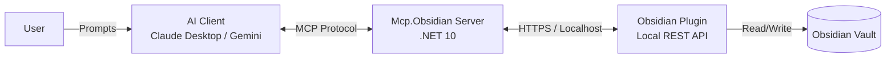

## Mcp.Obsidian


**Mcp.Obsidian** is a .NET 10 Model Context Protocol (MCP) server that bridges AI agents (Claude, Gemini, Cursor, and more) with your local Obsidian vault.

It allows LLMs to read, search, and edit your notes safely using the [Obsidian Local REST API](https://github.com/coddingtonbear/obsidian-local-rest-api), keeping your knowledge base local-first while enabling AI automation.

This 33-tool server is designed to feel much closer to a real Obsidian operator than a thin note CRUD wrapper. It can work with normal vault files, the active note, periodic notes, command execution, vault queries, backlink-aware analysis, workspace scaffolding, kanban boards, and MCP resources.

## What Makes It Different

- It is not limited to file CRUD. It can reason about headings, links, backlinks, periodic notes, and Obsidian commands.
- It exposes higher-level agent workflows like smart append, daily note automation, and workspace scaffolding.
- It supports both Obsidian REST mode and direct filesystem mode for offline vault access.
- It speaks MCP over stdio and HTTP/SSE so more MCP clients can attach cleanly.
- It exposes vault notes as MCP Resources, not just tools.

### Why this is useful

- Keep your notes local while still letting MCP-compatible clients work with them.
- Give Claude Desktop, Cursor, Gemini, and other MCP tools structured access to your Obsidian vault.
- Avoid brittle copy-paste workflows by letting agents search, read, create, and update notes directly.
- Build on top of the widely used Obsidian Local REST API instead of inventing a custom plugin.
- Cover higher-level workflows like daily notes, heading-aware appends, command execution, kanban parsing, and workspace bootstrapping.

> [!NOTE]
> A demo image is not included in this repository yet, so the placeholder caption has been removed for now.
> Once a real recording exists, add it back as something like ``.

---

## 🏗 Architecture


```mermaid
graph LR
    A[User] -->|Prompts| B[AI Client<br>Claude Desktop / Gemini]
    B <-->|MCP Protocol| C[Mcp.Obsidian Server<br>.NET 10]
    C <-->|HTTPS / Localhost| D[Obsidian Plugin<br>Local REST API]
    D -->|Read/Write| E[(Obsidian Vault)]

```

---

## 🚀 Getting Started

### ✨ Choose Your Mode

- `REST mode`: Connect through the Obsidian Local REST API plugin while Obsidian is running.
- `Filesystem mode`: Point the server at a vault folder with `--vault-path=/absolute/path/to/vault` and work without Obsidian running.
- `HTTP mode`: Add `--http-port=7474` to expose MCP over `http://localhost:7474/mcp` with SSE at `http://localhost:7474/sse`.

### 1. Prerequisites

You will need:

- **Obsidian Desktop**
- **.NET 10 SDK**
- **Obsidian Local REST API** community plugin by `coddingtonbear`

Install and enable the Obsidian plugin:

1. Open Obsidian.
2. Go to `Settings` → `Community plugins`.
3. Install and enable `Local REST API`.
4. Open the plugin settings.
5. Copy the API key.

### 2. Install A Binary Or Build From Source

#### Option A: Download a Prebuilt Release

Go to the GitHub Releases page and download the archive for your platform:

- `Mcp.Obsidian-linux-x64.tar.gz`
- `Mcp.Obsidian-linux-arm64.tar.gz`
- `Mcp.Obsidian-win-x64.zip`
- `Mcp.Obsidian-osx-arm64.tar.gz`

Unpack it anywhere on your machine, then create an `appsettings.json` file next to the binary or provide the equivalent environment variables.

#### Option B: Build From Source

Clone the repository and create your local config:

```bash
git clone https://github.com/yourusername/Mcp.Obsidian.git
cd Mcp.Obsidian
cp appsettings.json.example appsettings.json
```

Update `appsettings.json` in the repo root with your Obsidian connection details:

```json
{
  "Obsidian": {
    "BaseUrl": "https://127.0.0.1:27124",
    "ApiKey": "YOUR_OBSIDIAN_API_KEY_HERE",
    "VerifySsl": false
  }
}

```

For filesystem mode, you do not need an API key:

```bash
dotnet run --project src/Mcp.Obsidian/Mcp.Obsidian.csproj -- --vault-path=/absolute/path/to/vault
```

You can also configure the server via environment variables:

```bash
export OBSIDIAN__BASEURL=https://127.0.0.1:27124
export OBSIDIAN__APIKEY=YOUR_OBSIDIAN_API_KEY_HERE
export OBSIDIAN__VERIFYSSL=false
```

### 3. Build Or Publish Locally

Build the MCP server:

```bash
dotnet build src/Mcp.Obsidian/Mcp.Obsidian.csproj
```

Publish a standalone folder for the current machine:

```bash
dotnet publish src/Mcp.Obsidian/Mcp.Obsidian.csproj -c Release -o ./artifacts/obsidian-mcp
```

Publish a single-file binary for a specific platform:

```bash
dotnet publish src/Mcp.Obsidian/Mcp.Obsidian.csproj \
  -c Release \
  -r linux-x64 \
  -p:PublishSingleFile=true \
  -p:SelfContained=true \
  -o ./artifacts/linux-x64
```

Publish a NativeAOT binary with ONNX semantic search disabled:

```bash
dotnet publish src/Mcp.Obsidian/Mcp.Obsidian.csproj \
  -c Release \
  -r osx-arm64 \
  -p:AOT=true
```

### 4. Connect It To Your MCP Client

The server uses the MCP stdio transport, so any MCP-compatible tool that can launch a local command can use it.

#### Claude Desktop

Add this to your `claude_desktop_config.json`:

```json
{
  "mcpServers": {
    "obsidian": {
      "command": "dotnet",
      "args": [
        "run",
        "--project",
        "/absolute/path/to/Mcp.Obsidian/src/Mcp.Obsidian/Mcp.Obsidian.csproj",
        "--",
        "--config=/absolute/path/to/Mcp.Obsidian/appsettings.json"
      ]
    }
  }
}

```

#### Generic MCP Client

If your MCP client prefers a built executable, point it to the published binary instead:

```json
{
  "mcpServers": {
    "obsidian": {
      "command": "/absolute/path/to/Mcp.Obsidian/artifacts/obsidian-mcp/Mcp.Obsidian",
      "args": []
    }
  }
}
```

Windows example:

```json
{
  "mcpServers": {
    "obsidian": {
      "command": "C:\\absolute\\path\\to\\Mcp.Obsidian.exe",
      "args": []
    }
  }
}
```

#### HTTP MCP Client

Launch the server with an HTTP port:

```bash
dotnet run --project src/Mcp.Obsidian/Mcp.Obsidian.csproj -- --http-port=7474
```

Then send MCP requests to `http://localhost:7474/mcp`.

### 5. Quick Start Checklist

1. Start Obsidian and make sure the `Local REST API` plugin is enabled.
2. Confirm your API key is present in `appsettings.json` or environment variables.
3. Download a release asset or run `dotnet build src/Mcp.Obsidian/Mcp.Obsidian.csproj`.
4. Add the MCP server entry to your client config.
5. Restart your MCP client.
6. Ask the client to call `obsidian_list_files` or `obsidian_search` as a smoke test.
7. If your client supports MCP Resources, try `resources/list` and `resources/read`.

### 6. First Prompts To Try

- "List the top-level files and folders in my vault."
- "Create `Inbox/HN Launch.md` with a launch checklist."
- "Append today’s status update to my daily note."
- "Show me which notes already mention or link to `HackerNews Launch`."
- "Create a new client workspace called `Acme` with folders and index notes."

---

## ✨ Feature Set

This MCP server now covers a much larger slice of what a human can do manually in Obsidian:

- Work locally through either the Obsidian REST plugin or direct filesystem access.
- Speak MCP over both stdio and HTTP/SSE.
- Expose vault notes as MCP Resources with `obsidian://vault/...` URIs.
- Work across three note scopes: vault files, the active note, and periodic notes.
- Read notes as markdown, parsed note JSON, or a document map for structural reasoning.
- Create, replace, append, patch, and delete notes instead of stopping at read-only automation.
- Cover semantic search, tag listing, note moves, vault stats, canvas reads, kanban parsing, task extraction, and graph traversal.
- Append under a specific heading path with `obsidian_smart_append`.
- Patch headings, blocks, or frontmatter fields with fine-grained target operations.
- Run simple text search plus richer Dataview DQL and JsonLogic vault queries.
- Inspect outgoing links, backlinks, and plain-text mention opportunities.
- Open notes in the desktop UI and execute Obsidian commands from MCP.
- Scaffold workspace folder structures with index notes for new projects or clients.
- Offer a NativeAOT publish path when you want a smaller binary and can skip ONNX semantic search.

## 🛠 Available Tools

| Tool | Description |
| --- | --- |
| `obsidian_list_files` | Lists files in a folder or at the vault root. |
| `obsidian_read_resource` | Reads vault, active, or periodic notes as markdown, note JSON, or document map. |
| `obsidian_write_resource` | Creates or replaces vault, active, or periodic notes. |
| `obsidian_append_resource` | Appends markdown to vault, active, or periodic notes. |
| `obsidian_delete_resource` | Deletes vault, active, or periodic notes. |
| `obsidian_patch_target` | Patches headings, blocks, or frontmatter with append, prepend, or replace. |
| `obsidian_daily_note` | Shorthand helper for current or dated daily note workflows. |
| `obsidian_read_note` | Retrieves the full markdown content of a specific note. |
| `obsidian_create_note` | Creates a new note with specified path and content. |
| `obsidian_append` | Appends text to the end of an existing note. |
| `obsidian_patch_frontmatter` | Updates or adds YAML frontmatter tags and metadata. |
| `obsidian_search` | Backward-compatible alias for simple vault text search. |
| `obsidian_search_simple` | Runs text search through the vault. |
| `obsidian_query_vault` | Runs Dataview DQL or JsonLogic queries through the vault. |
| `obsidian_extract_links` | Extracts wikilinks, embeds, and markdown links from a note. |
| `obsidian_backlink_report` | Reports outgoing links, backlinks, and mention candidates. |
| `obsidian_smart_append` | Appends under a matching heading path or creates it first. |
| `obsidian_open_note` | Opens a note in Obsidian. |
| `obsidian_list_commands` | Lists available Obsidian commands. |
| `obsidian_execute_command` | Executes an Obsidian command by id. |
| `obsidian_scaffold_workspace` | Scaffolds a new folder-based workspace with index notes. |
| `obsidian_list_all_tags` | Lists all tags found across the vault. |
| `obsidian_move_note` | Moves a note and can rewrite matching wikilinks. |
| `obsidian_get_vault_stats` | Computes vault-wide note, folder, size, tag, orphan, and recent activity stats. |
| `obsidian_batch_read` | Reads many notes with optional content and frontmatter. |
| `obsidian_extract_tasks` | Extracts markdown tasks across the vault or a folder. |
| `obsidian_list_broken_links` | Finds unresolved wikilinks in the vault. |
| `obsidian_graph_traverse` | Traverses linked notes outward, inward, or both up to a depth limit. |
| `obsidian_read_canvas` | Reads an Obsidian canvas file and returns nodes and edges. |
| `obsidian_read_kanban` | Parses an Obsidian Kanban board into columns and cards. |
| `obsidian_vault_health` | Builds a vault health report with broken links, duplicates, orphans, and large files. |
| `obsidian_search_semantic` | Ranks vault notes using lexical plus semantic chunk relevance. |
| `obsidian_bulk_frontmatter` | Applies frontmatter updates to many notes filtered by folder and/or tag. |

---

## 💡 Example Uses

- "Find my meeting notes about roadmap planning from last month."
- "Create a note in `Inbox/` with the action items from this conversation."
- "Append this summary to `Projects/MCP.md`."
- "Set the frontmatter `status` field in `Tasks/ship-docs.md` to `done`."
- "List files in my `Daily/` folder before creating today’s note."
- "Append a standup summary to today’s daily note."
- "Append these decisions under `Projects::Launch::Decisions`, and create the heading path if it does not exist."
- "Run a Dataview query for all open tasks tagged `#hn-launch`."
- "Show me notes that already link to `Projects/HackerNews Launch.md` before creating a duplicate."
- "Create a fresh client workspace with Inbox, Projects, Resources, Archive, and Daily sections."
- "Read my `Planning/Board.md` Kanban board and summarize cards by column."
- "List vault resources and read `obsidian://vault/Inbox.md` as passive MCP context."
- "Execute the Obsidian command for opening the command palette or templater workflow."

---

## ✅ Quality Checks

- `dotnet build src/Mcp.Obsidian/Mcp.Obsidian.csproj`
- `dotnet test tests/Mcp.Obsidian.Tests/Mcp.Obsidian.Tests.csproj`
- `dotnet publish src/Mcp.Obsidian/Mcp.Obsidian.csproj -r linux-x64 -c Release`
- GitHub Actions release workflow builds release assets for `linux-x64`, `linux-arm64`, `win-x64`, and `osx-arm64`
- GitHub Actions CI runs automatically on every push to `main`

The test suite covers markdown helpers, graph traversal, semantic ranking fallback behavior, filesystem mode, kanban parsing, and backlink analysis.

## 📦 Releases

This repository includes GitHub Actions workflows at [.github/workflows/ci.yml](/Users/sarvesh/Mcp.Obsidian/.github/workflows/ci.yml) and [.github/workflows/release.yml](/Users/sarvesh/Mcp.Obsidian/.github/workflows/release.yml) that:

- ✅ run tests on `main`
- 📦 publish single-file self-contained binaries
- 🖥 package artifacts for Linux x64, Linux arm64, Windows x64, and macOS Apple Silicon
- 🚀 upload those assets to a GitHub Release when you push a tag like `v0.5.0`

To cut a release:

```bash
git tag v0.5.0
git push origin v0.5.0
```

---

## 🛡 Security & Permissions

* **Local Execution:** This server runs entirely on your machine. No data is sent to a third-party cloud other than the LLM provider you are already using.
* **HTTPS:** The Local REST API uses self-signed certificates. The `VerifySsl: false` setting is required unless you configure local trust.
* **Scoped Access:** In REST mode, the server can only access the vault where the Local REST API plugin is active.
* **Filesystem Mode:** In `--vault-path` mode, the server accesses the vault folder directly and blocks path traversal outside the configured root.
* **Configuration:** Keep `appsettings.json` local to your machine and never commit your Obsidian API key.

---

## 🔧 Troubleshooting

- If the MCP client cannot connect, make sure Obsidian is running and the Local REST API plugin is enabled.
- If you are using filesystem mode, make sure `--vault-path` points to the vault root and that the process can read that folder.
- If you are using HTTP mode, make sure the chosen `--http-port` is free and send MCP POST requests to `/mcp`.
- If requests fail with authentication errors, re-copy the API key from Obsidian into `appsettings.json`.
- If TLS validation fails, keep `VerifySsl` set to `false` unless you have explicitly trusted the local certificate.
- If your MCP client cannot launch `dotnet run`, publish the app first and point the client at the binary in `artifacts/obsidian-mcp`.
- If a patch against a heading fails, read the note as `document_map` first to inspect the exact heading path the API expects.
- If Linux NativeAOT publish fails on macOS, build that RID on a Linux runner or native Linux machine instead of cross-linking locally.

---

## 🗺 Roadmap

* [x] Basic CRUD (Create, Read, Search, Append).
* [x] Frontmatter manipulation.
* [x] **Smart Append:** Append contextually under specific H2/H3 headers.
* [x] **Backlink Logic:** AI awareness of existing links before creating new ones.
* [x] **Daily Note Helper:** Shorthand tools for modifying the current daily note.
* [x] **Command Automation:** List and execute Obsidian commands from MCP.
* [x] **Workspace Scaffolding:** Bootstrap project or client workspaces with structured folders and notes.
* [x] **Graph traversal (BFS/DFS):** Traverse incoming and outgoing note relationships from a starting note.
* [ ] **Templates and Capture Flows:** First-class helpers around templater-style workflows.
* [ ] **Graph-Aware Planning:** Deeper link graph reasoning before large note rewrites.

---

## 🤝 Contributing

Contributions are welcome.

1. Fork the repo.
2. Create your feature branch (`git checkout -b feature/amazing-feature`).
3. Commit your changes.
4. Open a Pull Request.

## 📄 License

Distributed under the MIT License. See `LICENSE` for more information.
