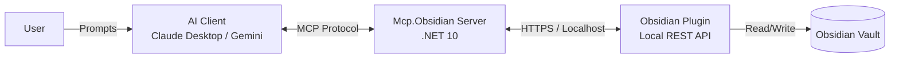

## Mcp.Obsidian


**Mcp.Obsidian** is a .NET 10 Model Context Protocol (MCP) server that bridges AI agents (Claude, Gemini, etc.) with your local Obsidian vault.

It allows LLMs to read, search, and edit your notes safely using the [Obsidian Local REST API](https://github.com/coddingtonbear/obsidian-local-rest-api), keeping your knowledge base local-first while enabling AI automation.

### Why this is useful

- Keep your notes local while still letting MCP-compatible clients work with them.
- Give Claude Desktop, Cursor, Gemini, and other MCP tools structured access to your Obsidian vault.
- Avoid brittle copy-paste workflows by letting agents search, read, create, and update notes directly.
- Build on top of the widely used Obsidian Local REST API instead of inventing a custom plugin.

> [!NOTE]
> A demo image is not included in this repository yet, so the placeholder caption has been removed for now.
> Once a real recording exists, add it back as something like ``.

---

## 🏗 Architecture


```mermaid
graph LR
    A[User] -->|Prompts| B[AI Client<br>Claude Desktop / Gemini]
    B <-->|MCP Protocol| C[Mcp.Obsidian Server<br>.NET 10]
    C <-->|HTTPS / Localhost| D[Obsidian Plugin<br>Local REST API]
    D -->|Read/Write| E[(Obsidian Vault)]

```

---

## 🚀 Getting Started

### 1. Prerequisites

You will need:

- **Obsidian Desktop**
- **.NET 10 SDK**
- **Obsidian Local REST API** community plugin by `coddingtonbear`

Install and enable the Obsidian plugin:

1. Open Obsidian.
2. Go to `Settings` → `Community plugins`.
3. Install and enable `Local REST API`.
4. Open the plugin settings.
5. Copy the API key.

### 2. Clone and Configure

Clone the repository and create your local config:

```bash
git clone https://github.com/yourusername/Mcp.Obsidian.git
cd Mcp.Obsidian
cp appsettings.json.example appsettings.json
```

Update `appsettings.json` in the repo root with your Obsidian connection details:

```json
{
  "Obsidian": {
    "BaseUrl": "https://127.0.0.1:27124",
    "ApiKey": "YOUR_OBSIDIAN_API_KEY_HERE",
    "VerifySsl": false
  }
}

```

You can also configure the server via environment variables:

```bash
export OBSIDIAN__BASEURL=https://127.0.0.1:27124
export OBSIDIAN__APIKEY=YOUR_OBSIDIAN_API_KEY_HERE
export OBSIDIAN__VERIFYSSL=false
```

### 3. Build

Build the MCP server:

```bash
dotnet build src/Mcp.Obsidian/Mcp.Obsidian.csproj
```

Publish a standalone folder for any MCP-compatible client:

```bash
dotnet publish src/Mcp.Obsidian/Mcp.Obsidian.csproj -c Release -o ./artifacts/obsidian-mcp
```

### 4. Connect It To Your MCP Client

The server uses the MCP stdio transport, so any MCP-compatible tool that can launch a local command can use it.

#### Claude Desktop

Add this to your `claude_desktop_config.json`:

```json
{
  "mcpServers": {
    "obsidian": {
      "command": "dotnet",
      "args": [
        "run",
        "--project",
        "/absolute/path/to/Mcp.Obsidian/src/Mcp.Obsidian/Mcp.Obsidian.csproj",
        "--",
        "--config=/absolute/path/to/Mcp.Obsidian/appsettings.json"
      ]
    }
  }
}

```

#### Generic MCP Client

If your MCP client prefers a built executable, point it to the published binary instead:

```json
{
  "mcpServers": {
    "obsidian": {
      "command": "/absolute/path/to/Mcp.Obsidian/artifacts/obsidian-mcp/Mcp.Obsidian",
      "args": []
    }
  }
}
```

### 5. Quick Start Checklist

1. Start Obsidian and make sure the `Local REST API` plugin is enabled.
2. Confirm your API key is present in `appsettings.json` or environment variables.
3. Run `dotnet build src/Mcp.Obsidian/Mcp.Obsidian.csproj`.
4. Add the MCP server entry to your client config.
5. Restart your MCP client.
6. Ask the client to call `obsidian_list_files` or `obsidian_search` as a smoke test.

---

## ✨ Feature Set

This MCP server is designed for the most common note automation workflows:

- Search a vault when an agent needs to find the right note quickly.
- Read a note when the agent needs full markdown context.
- Create a new note from scratch.
- Append information to an existing note without manually opening Obsidian.
- Update frontmatter fields for tags, status, metadata, or workflow state.
- List files in a folder so an agent can navigate your vault safely.

## 🛠 Available Tools

| Tool | Description |
| --- | --- |
| `obsidian_search` | Uses the REST API to fuzzy search file names and content. |
| `obsidian_read_note` | Retrieves the full markdown content of a specific note. |
| `obsidian_create_note` | Creates a new note with specified path and content. |
| `obsidian_append` | Appends text to the end of an existing note. |
| `obsidian_patch_frontmatter` | Updates or adds YAML frontmatter tags/metadata. |
| `obsidian_list_files` | Lists files in a specific folder. |

---

## 💡 Example Uses

- "Find my meeting notes about roadmap planning from last month."
- "Create a note in `Inbox/` with the action items from this conversation."
- "Append this summary to `Projects/MCP.md`."
- "Set the frontmatter `status` field in `Tasks/ship-docs.md` to `done`."
- "List files in my `Daily/` folder before creating today’s note."

---

## 🛡 Security & Permissions

* **Local Execution:** This server runs entirely on your machine. No data is sent to a third-party cloud other than the LLM provider you are already using (e.g., Anthropic).
* **HTTPS:** The Local REST API uses self-signed certificates. The `VerifySsl: false` setting is required unless you configure local trust.
* **Scoped Access:** The server can only access the vault where the Local REST API plugin is active.
* **Configuration:** Keep `appsettings.json` local to your machine and never commit your Obsidian API key.

---

## 🔧 Troubleshooting

- If the MCP client cannot connect, make sure Obsidian is running and the Local REST API plugin is enabled.
- If requests fail with authentication errors, re-copy the API key from Obsidian into `appsettings.json`.
- If TLS validation fails, keep `VerifySsl` set to `false` unless you have explicitly trusted the local certificate.
- If your MCP client cannot launch `dotnet run`, publish the app first and point the client at the binary in `artifacts/obsidian-mcp`.

---

## 🗺 Roadmap

* [x] Basic CRUD (Create, Read, Search, Append).
* [x] Frontmatter manipulation.
* [ ] **Smart Append:** Append contextually under specific H2/H3 headers.
* [ ] **Backlink Logic:** AI awareness of existing links before creating new ones.
* [ ] **Daily Note Helper:** Shorthand tools for modifying the current daily note.

---

## 🤝 Contributing

Contributions are welcome.

1. Fork the repo.
2. Create your feature branch (`git checkout -b feature/amazing-feature`).
3. Commit your changes.
4. Open a Pull Request.

## 📄 License

Distributed under the MIT License. See `LICENSE` for more information.
